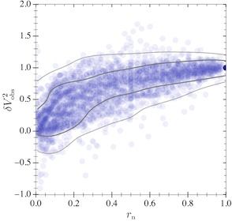

# NAVanalysis
Normalized Additional Velocity analysis (Release 2.0.1)

Code by Davi Rodrigues (UFES) and Alejandro Hernandez-Arboleda (UFES).

NAVanalysis is a code for stuying the non-Baryonic or non-Newtonian contributions to galaxy rotation curves straight from a given data sample, instead of first performing individual galaxy fits. The method is explained in the paper [D.C.Rodrigues, A. Hernandez-Arboleda, A. Wojnar, PDU (2023)](https://doi.org/10.1016/j.dark.2023.101230). arXiv: [[2204.03762]](http://arxiv.org/abs/2204.03762).  NAVanalysis is a fast and complementary approach to standard individual fits, it focus on sample results about the radial dependence of the dark matter profile (or the modified gravity one).

This code include applications for the following dark matter profiles: Navarro-Frenk-White, Burkert, DiCintio14 (DC14), and a phenomenological arctan-based profile. Moreover, it also includes results for Modified Newtonian Dynamics (MOND), see [[2204.03762]](http://arxiv.org/abs/2204.03762) for further details on these applications. 

See also [[2306.04475]](https://arxiv.org/abs/2306.04475) for a recent application on Palatini $f(R)$ gravity.

## Examples

**Fig. 1:** The observational NAV plane as inferred from 153 galaxies from the SPARC dataset. The horizontal axis is the normalized radius, and the vertical the normalized additional  (squared) velocity. The gray curves show the highest density regions. Each transparent blue disk is a data point from a galaxy. The dark blue disk with coordinates (1,1) is dark because all the galaxies contribute with this point.

**Fig.2:** NAV analysis for NFW and Burkert halos. Above one also finds a comparison with individual galaxy fits results. See [the main paper](https://doi.org/10.1016/j.dark.2023.101230) for further details.
## Files and folders explanation

* `NAVbaseCode.wl` is a package written in Wolfram Language that contains the core definitions for the execution of `NAVanalysis`.
* `NAVobservational.wl` executes the NAV method on the observational data and exports the results.
* `NAVanalysis.nb` is the main file that executes the NAV analysis considering different models (NFW, Burkert, Arctan, DC14 and MOND), for Mathematica notebook.
* `NAVanalysis.wl` is the same as above, but written in plain text. It can be run on Jupyter, VS Code or from the command line (with Wolfram Engine).
* `NAVauxiliaryFunctions.wl` contains new definitions that builds on `NAVbaseCode` and that aims on simplifying the use of `NAVanalysis`.
* `NAVoptions.wl` is a set of options mainly devoted for the plots.
* `ExportTables.wl` is a simple piece of code that converts the `.m` files in the `AuxiliaryData` folder into the `.tsv` files in the `Output` folder. The latter are human readable and easy to be manipulated from different apps and codes. 

* `AuxiliaryData` folder: 
  * `*.m` files: plain text files to be read by Mathematica. They contain the best fit results as generated by [MAGMA](https://github.com/davi-rodrigues/MAGMA) for 153 galaxies and for different models. 
  * `MDC14aux.mx` binary file to speed up the execution of the DC14 analysis. If this file is deleted, or if it cannot be read, it will be generated by NAVanalysis when necessary.
  * `SPARC_Rotmod` sulbolder: the observational data from the SPARC data sample of galaxies was inserted here. We are providing these data for easy of use. The original data can be found [here](http://astroweb.cwru.edu/SPARC/) and they do not constitute part of `NAVanalysis`.

* `Output` folder: it contains data and plot files that were generated by this code.

* `LICENSE` this code should be distributed with this license (MIT).

## Other packages

* Some of the plots require the [CustomTicks package](https://github.com/mark-caprio/CustomTicks), it can be freely downloaded and used.
* [MAGMA](https://github.com/davi-rodrigues/MAGMA) is helpful to generate new galaxy fit results, but it is not necessary to run NAVanalysis: the relevant MAGMA output is provided in the `AuxiliaryData` folder. 

## Acknowledgements

This work was in part supported by the following Brazilian funding agencies: CAPES, CNPq and FAPES.
